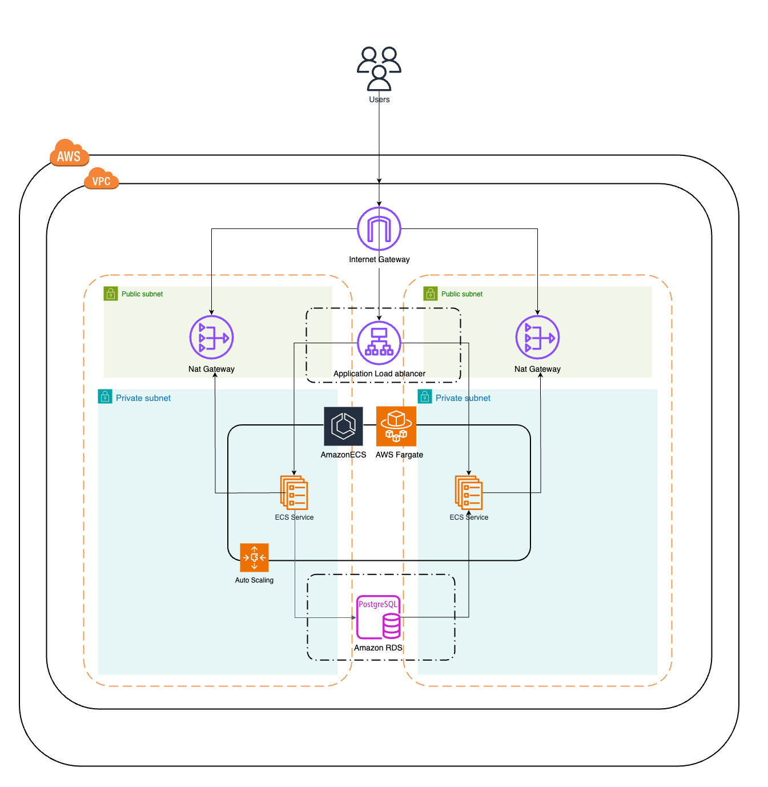

# High-Level Infrastructure and CI/CD Pipeline Documentation

## 1. Overview
The solution delivers a complete **CI/CD pipeline** for both application deployment and infrastructure provisioning. It leverages **Terraform** for Infrastructure as Code (IaC), **AWS** as the cloud provider, and **GitHub Actions** for pipeline automation.

This document outlines the architecture, pipelines, and design decisions that make the system scalable, secure, monitored, and easily maintainable.

---

## 2. Solution Goals
1. **Infrastructure Provisioning**: A pipeline to deploy infrastructure using Terraform.
2. **CI/CD Pipeline**: A robust application deployment pipeline for building, testing, and deploying Docker containers.
3. **Scalability**: The infrastructure auto-scales based on demand.
4. **Monitoring**: CloudWatch is used to monitor resources and performance.
5. **Multi-Account Support**: Seamless deployment across personal environments with configurable secrets and variables.

---

## 3. Architecture Overview

### 3.1 Cloud Infrastructure

The cloud architecture includes the following components:

- **VPC**: Provides network isolation with public and private subnets.
- **Application Load Balancer (ALB)**: Manages and distributes inbound traffic to ECS services.
- **Amazon ECS with Fargate**: Container orchestration for running application workloads.
- **NAT Gateways**: Allow secure outbound internet access from private subnets.
- **Amazon RDS (PostgreSQL)**: Managed database service for storing application data.
- **Auto Scaling**: Dynamically scales ECS tasks based on CloudWatch metrics.

**Key Features**:
- Traffic flows securely through the **ALB** to ECS services in private subnets.
- Outbound internet access is managed using **NAT Gateways**.
- ECS tasks interact with the **PostgreSQL** database deployed in private subnets.

---

### 3.2 CI/CD Pipelines

The solution includes two pipelines: **Infrastructure CI/CD Pipeline** and **Application CI/CD Pipeline**.

#### **Application CI/CD Pipeline**
- **Purpose**: Builds, tests, and deploys the application across multiple environments (e.g., development, staging, and production).
- **Stages**:
   1. **Source Stage**: Triggered by a push to a specific branch.
   2. **Build and Test Stage**:
      - Source code is built.
      - Unit and integration tests are run.
   3. **Dockerization Stage**:
      - The application is containerized into a Docker image.
      - The image is pushed to **Amazon ECR**.
   4. **Deploy Stage**:
      - Updates ECS Task Definitions with the new image tag.
      - Deploys the updated service to **Amazon ECS**.

#### **Infrastructure CI/CD Pipeline**
- **Purpose**: Provisions and manages cloud infrastructure using Terraform.
- **Stages**:
   1. **Plan Stage**:
      - Runs `terraform init` and `terraform plan` to validate configurations.
   2. **Apply Stage**:
      - For **development, staging, and production** environments:
         - Runs `terraform apply` to provision infrastructure.
         - Approval checks are enforced before applying changes to production.

---

## 4. Design Choices

### Infrastructure as Code (IaC)
- **Terraform** was selected for its flexibility, modularity, and robust state management using **S3** and **DynamoDB** for state locking.

### AWS Fargate for ECS
- Fargate eliminates the need for server management and scales resources based on demand.

### Amazon RDS (PostgreSQL)
- RDS provides a managed, reliable, and highly available database with automatic backups.

### Application Load Balancer (ALB)
- The ALB efficiently distributes traffic while improving availability and fault tolerance.

### Monitoring with CloudWatch
- **CloudWatch** monitors:
   - Resource usage (e.g., CPU, memory).
   - Application performance and ECS service health.
- **Alarms** are configured to trigger auto-scaling events.

### Approval Gates
- Approval checks are implemented in GitHub Actions for production deployments, ensuring controlled and verified changes.

---

## 5. Scalability
- **ECS Auto Scaling**: Dynamically adjusts ECS task counts based on CloudWatch alarms (e.g., CPU usage > 70%).
- **RDS Vertical Scaling**: Can scale vertically to handle increased load on the database.

---

## 6. Conclusion
This solution provides a complete cloud infrastructure and CI/CD pipeline that:
- Automates infrastructure provisioning and application deployment.
- Monitors resource usage and scales infrastructure as needed.
- Allows deployment across multiple environments with approval gates for production changes.

By leveraging **AWS**, **Terraform**, and **GitHub Actions**, the architecture ensures reliability, scalability, and operational efficiency.