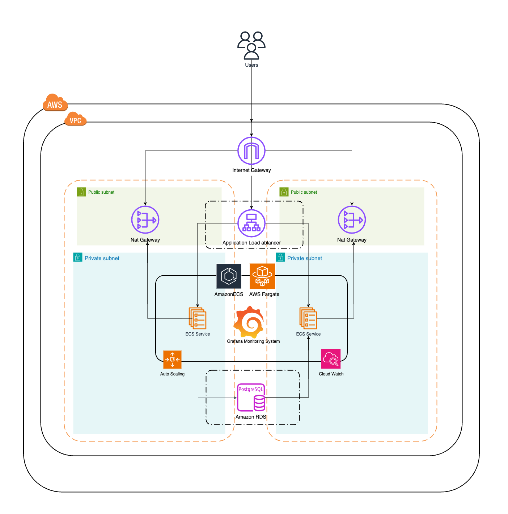
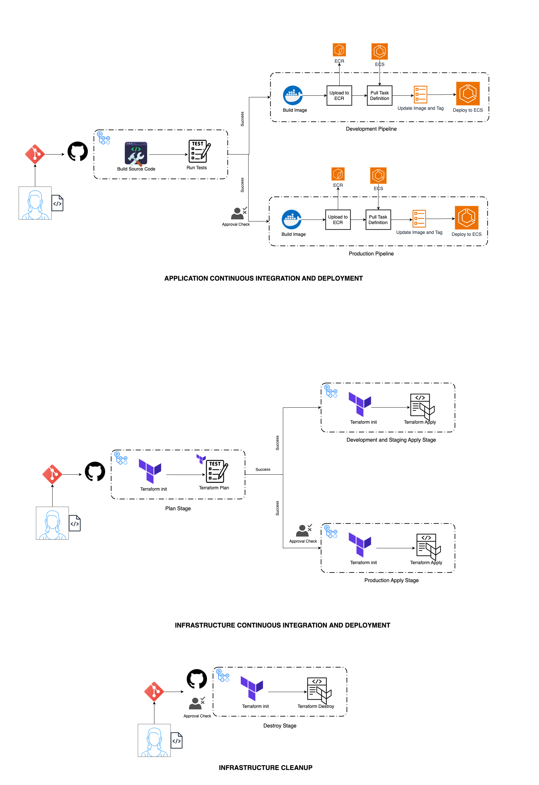

# High-Level Infrastructure and CI/CD Pipeline Documentation

## 1. Overview
The solution delivers a complete **CI/CD pipeline** for both application deployment and infrastructure provisioning, including a pipeline for infrastructure destruction. It leverages **Terraform** for Infrastructure as Code (IaC), **AWS** as the cloud provider, and **GitHub Actions** for pipeline automation. **Grafana**, deployed on ECS with persistent storage via EFS, is used for visualization of metrics collected by CloudWatch.

This document outlines the architecture, pipelines, and design decisions that make the system scalable, secure, monitored, and easily maintainable.

---

## 2. Solution Goals
1. **Infrastructure Provisioning**: A pipeline to deploy infrastructure using Terraform.
2. **CI/CD Pipeline**: A robust application deployment pipeline for building, testing, and deploying Docker containers.
3. **Infrastructure Destruction**: A pipeline to safely and cleanly destroy deployed infrastructure.
4. **Scalability**: The infrastructure auto-scales based on demand.
5. **Monitoring and Visualization**: CloudWatch is used to collect metrics, and Grafana, deployed on ECS with EFS, provides dashboards and visualizations.
6. **Multi-Account Support**: Seamless deployment across personal environments with configurable secrets and variables.

---

## 3. Architecture Overview

### 3.1 Cloud Infrastructure

The cloud architecture includes the following components:

- **VPC**: Provides network isolation with public and private subnets.
- **Application Load Balancer (ALB)**: Manages and distributes inbound traffic to ECS services.
- **Amazon ECS with Fargate**: Container orchestration for running application workloads, including the Grafana instance.
- **Amazon EFS**: Provides persistent storage for Grafana configurations and dashboards.
- **NAT Gateways**: Allow secure outbound internet access from private subnets.
- **Amazon RDS (PostgreSQL)**: Managed database service for storing application data.
- **Auto Scaling**: Dynamically scales ECS tasks based on CloudWatch metrics.
- **Grafana (on ECS with EFS)**: Provides visualization and dashboards based on CloudWatch data sources.

**Key Features**:
- Traffic flows securely through the **ALB** to ECS services in private subnets.
- Outbound internet access is managed using **NAT Gateways**.
- ECS tasks interact with the **PostgreSQL** database deployed in private subnets.
- **Grafana**, running on ECS with persistent storage on **EFS**, retrieves metrics from **CloudWatch** to create dashboards.

---

### 3.2 CI/CD Pipelines

The solution includes three pipelines: **Infrastructure CI/CD Pipeline**, **Application CI/CD Pipeline**, and **Infrastructure Destruction Pipeline**.

#### **Application CI/CD Pipeline**
- **Purpose**: Builds, tests, and deploys the application across multiple environments (e.g., development, staging, and production). This also includes the deployment of the Grafana container.
- **Stages**:
   1. **Source Stage**: Triggered by a push to a specific branch.
   2. **Build and Test Stage**:
      - Source code is built.
      - Unit and integration tests are run.
   3. **Dockerization Stage**:
      - The application (and Grafana if changes are detected) is containerized into a Docker image.
      - The image is pushed to **Amazon ECR**.
   4. **Deploy Stage**:
      - Updates ECS Task Definitions with the new image tag.
      - Deploys the updated service to **Amazon ECS**.

#### **Infrastructure CI/CD Pipeline**
- **Purpose**: Provisions and manages cloud infrastructure using Terraform, including the EFS file system for Grafana persistence.
- **Stages**:
   1. **Plan Stage**:
      - Runs `terraform init` and `terraform plan` to validate configurations.
   2. **Apply Stage**:
      - For **development, staging, and production** environments:
         - Runs `terraform apply` to provision infrastructure, including EFS.
         - Approval checks are enforced before applying changes to production.

#### **Infrastructure Destruction Pipeline**
- **Purpose**: Removes all cloud resources managed by Terraform.
- **Trigger**: Manual trigger.
- **Process**:  Executes `terraform destroy`.

---

## 4. Design Choices

### Infrastructure as Code (IaC)
- **Terraform** was selected for its flexibility, modularity, and robust state management using **S3** and **DynamoDB** for state locking.

### AWS Fargate for ECS
- Fargate eliminates the need for server management and scales resources based on demand, both for the application and the Grafana instance.

### Amazon RDS (PostgreSQL)
- RDS provides a managed, reliable, and highly available database with automatic backups.

### Application Load Balancer (ALB)
- The ALB efficiently distributes traffic while improving availability and fault tolerance.

### Monitoring with CloudWatch and Grafana
- **CloudWatch** monitors:
   - Resource usage (e.g., CPU, memory).
   - Application performance and ECS service health.
- **Alarms** are configured to trigger auto-scaling events.
- **Grafana**, deployed as an ECS service with persistent storage on **EFS**, retrieves metrics from **CloudWatch** and provides rich visualizations and dashboards. This ensures that Grafana dashboards and configurations are persisted across deployments.

### Approval Gates
- Approval checks are implemented in GitHub Actions for production deployments, ensuring controlled and verified changes. While the `destroy` pipeline uses `--auto-approve`, careful consideration should be given to potentially adding a manual approval step for production environments to prevent accidental destruction.

---

## 5. Scalability
- **ECS Auto Scaling**: Dynamically adjusts ECS task counts based on CloudWatch alarms (e.g., CPU usage > 70%), both for the application and Grafana.

---

## 6. Conclusion
This solution provides a complete cloud infrastructure and CI/CD pipeline that:
- Automates infrastructure provisioning and application deployment.
- Monitors resource usage and scales infrastructure as needed.
- Allows deployment across multiple environments with approval gates for production changes.
- Provides robust monitoring and visualization using CloudWatch and Grafana, with persistent storage for Grafana configurations.
- Includes a dedicated pipeline for safe and controlled infrastructure destruction.

By leveraging **AWS**, **Terraform**, and **GitHub Actions**, the architecture ensures reliability, scalability, and operational efficiency.